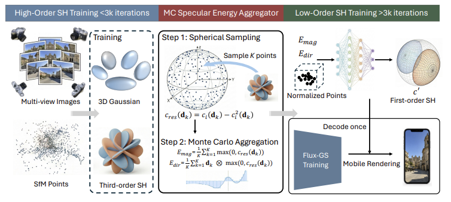

<h2 align="center"> <a href="https://xiaobiaodu.github.io/flux-gs-project/">Monte Carlo Energy Aggregation for Mobile 3D Gaussian Splatting</a></h2>
<h5 align="center"> If you like our project, please give us a star ⭐ on GitHub for latest update.  </h2>

<h5 align="center">

[](https://xiaobiaodu.github.io/flux-gs-project/)
[](https://arxiv.org/pdf/2606.30017)


## 😮 Highlights


<!--  -->


## 🚩 **Updates**

Welcome to **watch** 👀 this repository for the latest updates.


✅ **[2026.6.30]** : You are free to use the ideas of Flux-GS for commercial usage.

✅ **[2026.6.30]** : The code of our WebGL mobile renderer is realease, you can refer to [code](https://github.com/xiaobiaodu/flux-gs-project).

✅ **[2026.6.30]** : Release [project page](https://xiaobiaodu.github.io/flux-gs-project//).

✅ **[2026.6.30]** : Code Release. 


## Setup

For installation:
We recommend to use cuda 12.6 with python 3.11 for easy setup.
```shell
git clone git@github.com:xiaobiaodu/Flux-GS.git

conda create -n flux-gs python==3.11
conda activate flux-gs

pip install torch torchvision --index-url https://download.pytorch.org/whl/cu126
pip install --no-build-isolation -r requirements.txt
```
#### Install [TMC (GPCC)](https://github.com/MPEGGroup/mpeg-pcc-tmc13), and add tmc3 to your environment variable or manually specify its location in [the code](https://github.com/xiaobiaodu/Mobile-GS/blob/e95583bb3817d8e89b23029f7669d2656c65c6ab/utils/gpcc_utils.py#L243-L269) (lines 243 and 258, this script is sourced from [HAC++](https://github.com/YihangChen-ee/HAC-plus)).
If you have trouble in installing cuml, please refer to the [CUML Installation Guide](https://docs.rapids.ai/install/).

We used [Mip-NeRF 360](https://jonbarron.info/mipnerf360/), [Tanks & Temples, and Deep Blending](https://repo-sam.inria.fr/fungraph/3d-gaussian-splatting/datasets/input/tandt_db.zip).

## Running


```shell
sh train.sh

# To improve rendering perofmrance, you can use multi-view training from MVGS. It may cause longer training time and memory.
python train.py ... --mv  3
```

## Evaluation
The trained weights are released on [Huggingface](https://huggingface.co/datasets/mobile-gs2/mobile-gs2)
```shell
python render.py -s <path to COLMAP> -m <model path> --decode
python metrics.py -m <model path> 
```
#### --decode
Rendering with the compressed file (comp.json), otherwise using the ply file. The results are the same regardless of this option.


## Mobile Rendering
We save the trained Gaussian Splatting file as `.json` for better loading in WebGL with point cloud and MLP decompression. 
Our WebGL mobile render is open to the public. The code is (here)[https://github.com/xiaobiaodu/flux-gs-project]

## 👍 **Acknowledgement**
This work is built on many amazing research works and open-source projects, thanks a lot to all the authors for sharing!
* [Mobile-GS](https://github.com/xiaobiaodu/Mobile-GS)
* [MVGS](https://github.com/xiaobiaodu/MVGS)
* [FastGS](https://github.com/fastgs/FastGS)


## BibTeX
```
@misc{du2026mobile-gs,
      title={Mobile-GS: Real-time Gaussian Splatting for Mobile Devices}, 
      author={Xiaobiao Du and Yida Wang and Kun Zhan and Xin Yu},
      year={2026},
      eprint={2603.11531},
      archivePrefix={arXiv},
      primaryClass={cs.CV},
      url={https://arxiv.org/abs/2603.11531}, 
}

@inproceedings{du2026fluxgs,
  title={Monte Carlo Energy Aggregation for Mobile 3D Gaussian Splatting},
      author={Xiaobiao Du and Yuan Wang, and Hao Li, and Bosheng wang, and Xun Sun,  and Xin Yu},
  booktitle={European Conference on Computer Vision (ECCV)},
  year={2026}
}

```
